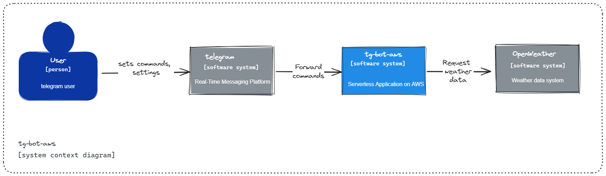
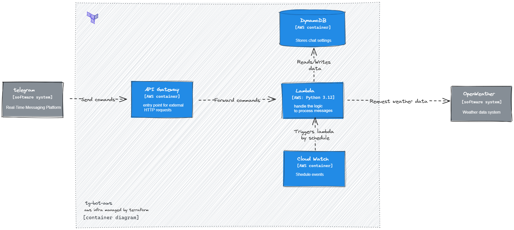

## Project Description

This project is implementation telegram bot on aws serverless stack. 

## C4 Diagrams

### System Context



### Container Diagram


# tg-bot-aws

Create lambda layer and publish it
```
mkdir python-bot-layer
cd python-bot-layer
pip install requests -t ./python
zip -r python-bot-layer.zip .

aws lambda publish-layer-version --layer-name python-bot-layer --zip-file fileb://python-bot-layer.zip --compatible-runtimes python3.12
```
## Infrastructure
Initialize backend
```
terraform init -backend-config=.terraform.backend.hcl
```
Apply terraform infra
```
terraform apply -var-file=".tfvars"
```
Trigger lambda from local environment

```
aws lambda invoke --function-name weather_bot --payload file://events/event.json --cli-binary-format raw-in-base64-out outfile.txt
```

Run some tests
```
cd src ;python -m unittest 
```

## telegram bot settings

Set webhook to telegram bot
```
curl https://api.telegram.org/bot{my_bot_token}/setWebhook?url={url_to_send_updates_to}
```